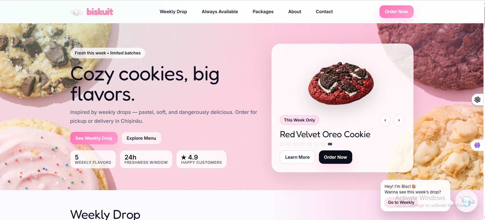
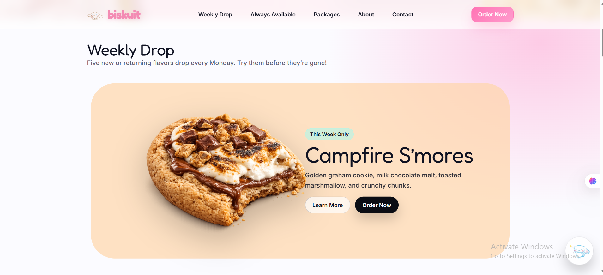
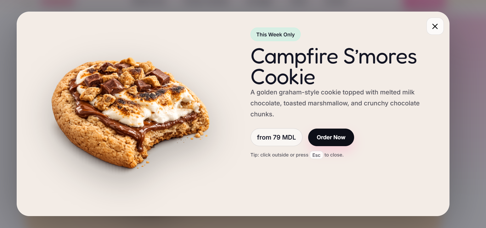
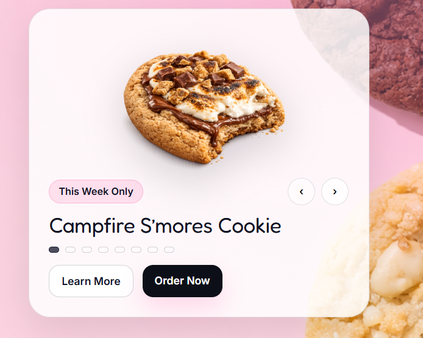
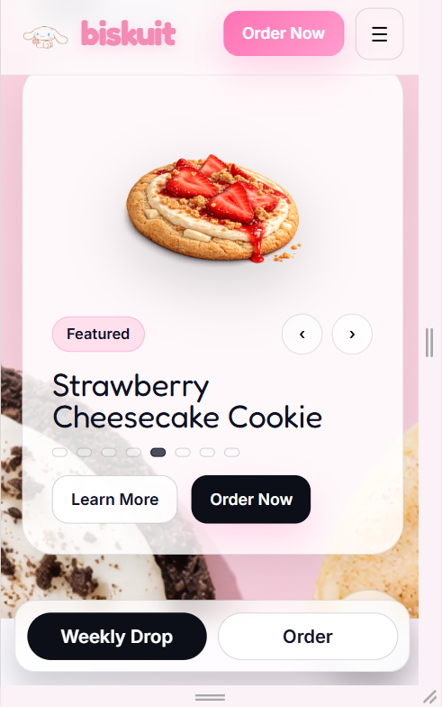
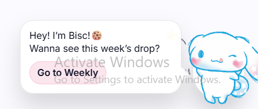

# 🍪 Biskuit --- Landing Page

Biskuit is a modern, pastel-inspired cookie shop landing page created
for Web Programming Laboratory assignments (Lab 2 & Lab 3).

The project focuses on responsive design, interactive UI components,
animations, and clean frontend architecture using **vanilla HTML, CSS,
and JavaScript**.

------------------------------------------------------------------------

## 🌐 Live Demo

🔗 **Live Website:**\
https://loredanaahsl.github.io/tum-web-lab2/

------------------------------------------------------------------------

## 🧁 Project Overview

Biskuit is a cookie shop concept inspired by weekly drop bakeries.\
The landing page includes:

-   Hero section with strong call-to-action
-   Weekly Drop section with interactive cookie showcase
-   Modal system with per-cookie themed design
-   Weekly slideshow preview in hero
-   Fully responsive layout (mobile-first improvements)
-   Animated cookie mascot assistant
-   Back-to-top interaction
-   Mobile sticky CTA bar
-   Custom brand typography & favicon

------------------------------------------------------------------------

## 📸 Screenshots

### 🏠 Hero Section

The hero section includes the weekly slideshow preview, primary CTA
buttons, and featured cookie display.

------------------------------------------------------------------------

### 🍪 Weekly Cookie Showcase

Alternating cookie layout with hover highlight and themed styling.

------------------------------------------------------------------------

### 🪟 Cookie Modal

Themed modal popup with cookie details, badge, description, and order
button.

------------------------------------------------------------------------

### 🎠 Weekly Slideshow Preview

Interactive slideshow cycling every 6 seconds with navigation arrows and
dots.

------------------------------------------------------------------------

### 📱 Mobile View

Responsive stacked layout with sticky bottom CTA bar and optimized modal
behavior.

------------------------------------------------------------------------

### 🐰 Mascot Interaction

Animated mascot with tooltip and delayed appearance.

------------------------------------------------------------------------

## 🛠 Technologies Used

-   HTML5
-   CSS3 (custom variables, animations, media queries)
-   Vanilla JavaScript
-   Google Fonts (Fredoka)
-   GIF animations
-   Git & GitHub Pages

------------------------------------------------------------------------

## 📂 Project Structure

tum-web-lab2/ │ ├── index.html ├── reset.css ├── style.css ├── images/ │
├── favicon.png │ ├── mascot.gif │ ├── \[cookie images\] │ ├──
screenshots/ │ ├── hero.png │ ├── weekly.png │ ├── modal.png │ ├──
slideshow.png │ ├── mobile.png │ └── mascot.png │ └── README.md

------------------------------------------------------------------------

## 🚀 Development Highlights

This project demonstrates:

-   Modular CSS structure
-   Interactive UI state management
-   Responsive breakpoints implementation
-   Animation and delayed UI elements
-   Proper Git commit history structure
-   Clean separation of layout, style, and behavior

------------------------------------------------------------------------

## 👩‍💻 Author

Loredana Condrea\
Frontend-focused Software Engineering student\
Passionate about interactive UI and polished web experiences
